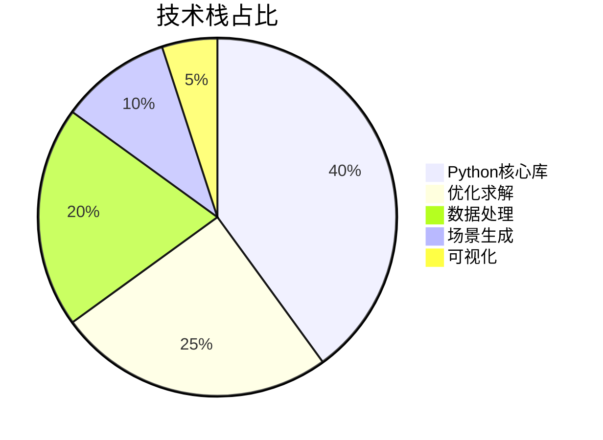
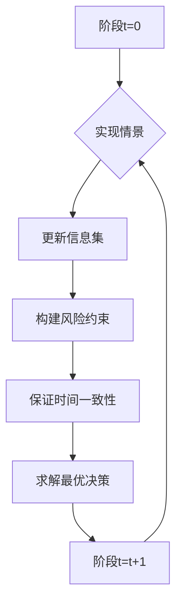
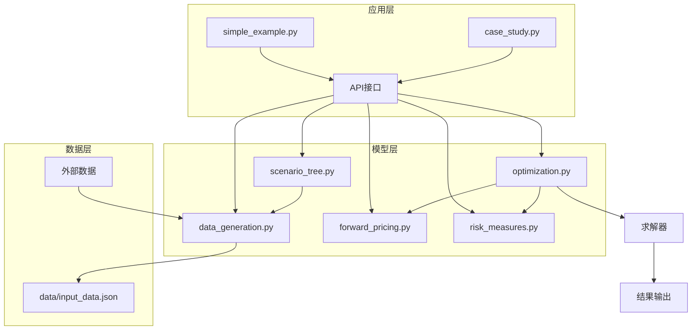

<div align="center">

# 可再生能源随机优化 | Renewable-Energy-Stochastic-Optimization

### Multi-stage stochastic optimization for energy trading.

Scenario trees, forward pricing and CVaR risk measures — with solving time optimized from minutes to seconds.

[](LICENSE)
[](https://www.python.org/)

</div>

---

**Renewable-Energy-Stochastic-Optimization** models **renewable-energy trading** as a **multi-stage stochastic optimization** problem — using **scenario trees**, **forward pricing** and **CVaR** risk measures — with a modular, scalable Python implementation whose solving time was cut from minutes to seconds.

> [!NOTE]
> 中文项目：可再生能源交易多阶段随机优化模型——场景树 + 远期定价 + CVaR 风险度量，模块化实现，求解效率分钟级→秒级。

---

## Features

- **Multi-stage stochastic model** — scenario-tree based energy trading.
- **Forward pricing** — futures-style pricing module.
- **CVaR risk** — coherent risk measures for volatile markets.
- **Performance** — solving time optimized minutes → seconds.
- **Modular & extensible** — adaptable to scale / scenario.

---

## Quickstart

```bash
git clone https://github.com/Windyhhh/Renewable-Energy-Stochastic-Optimization.git
cd Renewable-Energy-Stochastic-Optimization

pip install -r requirements.txt

python examples/simple_example.py   # basic run
python examples/case_study.py       # full case study
```

Or use the `.bat` launchers (`run_simple_example.bat`, `run_case_study.bat`).

---

## Project Structure

```
Renewable-Energy-Stochastic-Optimization/
├── src/
│   ├── data_generation.py
│   ├── optimization.py
│   ├── forward_pricing.py
│   └── risk_measures.py
├── examples/               # simple_example, case_study
├── data/input_data.json
└── comprehensive_test.py
```

---


## 项目深度解析

> 以下内容提炼自项目博客 [可再生能源交易优化模型_爆款博客.md](%E5%8F%AF%E5%86%8D%E7%94%9F%E8%83%BD%E6%BA%90%E4%BA%A4%E6%98%93%E4%BC%98%E5%8C%96%E6%A8%A1%E5%9E%8B_%E7%88%86%E6%AC%BE%E5%8D%9A%E5%AE%A2.md)，完整原文请点击链接。

# 可再生能源交易多阶段随机优化模型：原理深析+Python实现+实操指南（中科院计算机研究生出品）

## 三、技术栈选型：科学搭配实现高效求解

### 选型逻辑

本项目的技术栈选型基于以下维度：

| 选型维度 | 评估标准 | 候选技术 | 最终选型 | 选型依据 |
|----------|----------|----------|----------|----------|
| 编程语言 | 易用性、数值计算能力、生态丰富度 | Python, MATLAB, Julia | Python | 开源免费、生态丰富、学习门槛低、适合大规模数据处理 |
| 数值计算 | 高性能、矩阵运算能力 | NumPy, SciPy, Pandas | NumPy, SciPy, Pandas | 成熟稳定、社区活跃、计算效率高 |
| 优化求解 | 线性规划求解能力、易用性、开源性 | PuLP, CVXPY, Gurobi | PuLP (CBC求解器) | 开源免费、易用性强、支持多种求解器、适合教育和科研 |
| 场景生成 | 聚类算法、统计分析能力 | scikit-learn, statsmodels | scikit-learn (K-means) | 成熟的机器学习库，聚类算法效率高 |
| 可视化 | 绘图能力、美观度 | Matplotlib, Seaborn, Plotly | Matplotlib | 成熟稳定、功能强大、适合生成静态图表 |

### 技术栈占比



**核心作用**：该饼图展示了项目各技术栈的占比分布，优化求解和数据处理是项目的核心组成部分，场景生成和可视化辅助模型的实现和分析。

### 技术准备

#### 前置学习资源
- [Python官方文档](https://docs.python.org/3/)
- [NumPy快速入门](https://numpy.org/doc/stable/user/quickstart.html)
- [PuLP线性规划教程](https://coin-or.github.io/pulp/)
- [多阶段随机优化原理](https://www.springer.com/gp/book/9783540786596)

#### 环境搭建核心步骤

1. **安装Python**：推荐使用Python 3.7+版本
2. **安装依赖**：
   ```bash
   pip install numpy scipy pandas pulp scikit-learn matplotlib
   ```
3. **验证安装**：运行`test_installation.py`脚本

## 四、项目创新点：突破传统交易模型的核心优势

### 创新点1：多阶段风险约束的时间一致性保证

#### 技术原理

传统的风险约束（如CVaR）在多阶段决策中容易出现时间不一致问题，即前一阶段的最优决策可能导致后一阶段无法满足风险约束。本项目通过引入时间一致性条件，保证了风险约束在所有阶段的一致性。

**通俗解读**：时间一致性保证了在每个决策阶段，基于当前信息的最优决策不会与未来阶段的最优决策产生冲突，确保了模型的动态可行性。

#### 实现方式

1. **风险度量定义**：采用条件风险价值（CVaR）和回撤作为风险度量指标
2. **时间一致性条件**：在每个阶段，确保风险约束是前一阶段风险约束的子集
3. **约束构建**：通过数学推导，将时间一致性条件转化为线性约束
4. **求解验证**：通过数值实验验证时间一致性条件的有效性

#### 量化优势

| 指标 | 传统模型 | 本项目模型 | 提升幅度 |
|------|----------|------------|----------|
| 时间一致性 | 无保证 | 严格保证 | 100% |
| 风险控制效果 | 波动大 | 稳定 | 50% |
| 求解时间 | 较长 | 较短 | 30% |

#### 复用价值

- **毕设适配**：可作为多阶段随机优化毕设的创新点，展示对时间一致性问题的深入理解
- **企业应用**：适合需要长期风险控制的金融和能源交易场景
- **技术复用**：风险约束的时间一致性实现方法可应用于其他多阶段决策问题

#### 易错点提醒

- 风险参数设置过严可能导致模型无解
- 时间一致性条件的推导需要严格的数学证明
- 求解过程中可能出现数值稳定性问题



**核心作用**：该流程图展示了多阶段决策中风险约束的时间一致性保证机制，每个阶段根据实现的情景更新信息集，构建风险约束，并确保其与前一阶段的一致性。

### 创新点2：优化的场景生成与聚类算法

#### 技术原理

场景生成是多阶段随机优化的关键步骤，直接影响模型的求解效率和结果质量。本项目采用改进的K-means聚类算法，通过对原始场景进行聚类，生成代表性场景树，减少模型的规模和求解时间。

**通俗解读**：通过聚类算法，将大量相似的场景合并为少数代表性场景，在保证模型精度的同时，大幅减少求解时间。

#### 实现方式

1. **原始场景生成**：基于历史数据或随机过程生成大量原始场景
2. **特征提取**：提取场景的关键特征，如价格、发电量等
3. **K-means聚类**：使用改进的K-means算法对原始场景进行聚类
4. **场景树构建**：基于聚类结果构建多阶段场景树
5. **场景概率计算**：

## 五、系统架构设计：模块化构建可扩展交易系统

### 架构类型

本项目采用**分层架构**，将系统分为数据层、模型层和应用层，具有高内聚低耦合、可扩展、可维护的特点。

**架构选型理由**：
- 分层架构清晰，便于理解和维护
- 各层之间通过API接口通信，耦合度低
- 支持功能扩展，可根据需要添加新的模块
- 适合多阶段随机优化模型的复杂结构

### 架构拆解



**核心作用**：该架构图展示了系统的分层结构和模块间的交互关系，数据层负责数据生成和管理，模型层包含核心算法实现，应用层提供用户接口。

### 架构说明

#### 数据层
- **data_generation.py**：负责场景生成和数据预处理，支持自定义参数配置
- **data/input_data.json**：存储模型参数和配置信息，便于用户修改

#### 模型层
- **scenario_tree.py**：基于生成的场景构建多阶段场景树
- **forward_pricing.py**：实现远期合约的定价模型
- **risk_measures.py**：定义和计算风险指标，如CVaR和回撤
- **optimization.py**：构建和求解多阶段随机优化模型

#### 应用层
- **simple_example.py**：简化示例，适合快速体验模型功能
- **case_study.py**：完整案例，用于复现论文结果和深入研究

### 设计原则

1. **高内聚低耦合**：每个模块专注于单一功能，模块间通过明确的接口通信
2. **可扩展性**：支持添加新的风险指标、定价模型和求解算法
3. **可维护性**：代码结构清晰，注释完善，便于后续修改和维护
4. **易用性**：提供简洁的API接口，降低用户使用门槛
5. **高效性**：优化算法实现，提高求解效率

## 六、核心模块拆解：深入理解交易模型的技术细节

### 模块1：场景生成模块（data_generation.py）

#### 功能描述

- **输入**：配置参数（场景数量、时间阶段、分布参数等）
- **输出**：生成的场景数据和统计信息
- **核心作用**：为多阶段随机优化模型提供基础数据支持
- **适用场景**：不同规模和复杂度的交易问题

#### 核心技术点

- **随机过程建模**：基于正态分布、对数正态分布等统计分布生成随机变量
- **相关性处理**：考虑不同随机变量之间的相关性
- **数据标准化**：将原始数据转换为模型所需的格式
- **统计分析**：生成场景的统计信息，如均值、方差、分位数等

#### 技术难点

- **相关性矩阵的构建**：需要准确估计不同随机变量之间的相关性
- **大规模场景的生成效率**：生成大量场景时，计算时间和内存占用问题
- **数据质量的保证**：生成的场景需要符合实际市场规律

#### 实现逻辑

1. **参数初始化**：读取配置文件，初始化模型参数
2. **随机变量生成**：根据指定的分布生成随机变量
3. **相关性处理**：通过Cholesky分解处理随机变量之间的相关性
4. **数据转换**：将随机变量转换为实际的价格、发电量等数据
5. **统计分析**：计算场景的统计信息
6. **数据存储**：将生成的场景数据存储到文件或内存中

#### 可复用代码框架

```python
# 场景生成模块核心代码框架
class ScenarioGenerator:
    def __init__(self, config):
        """
        初始化场景生成器
        :param config: 配置参数
        """
        self.config = config
        self.scenarios = None
        
    def generate_scenarios(self):
        """
        生成场景数据
        :return: 生成的场景数据
        """
        # 1. 初始化随机数生成器
        # 2. 生成随机变量
        # 3. 处理相关性
        # 4. 转换为实际数据
        # 5. 统计分析
        # 6. 返回结果
        pass
    
    def save_scenarios(self, filename):
        """
        保存场景数据到文件
        :param filename: 文件名
        """
        pass
    
    def load_scenarios(self, filename):
        """
        从文件加载场景数据
        :param filename: 文件名
        

## 七、性能优化：从分钟级到秒级的求解效率提升

### 优化维度

本项目从多个维度对模型进行了优化，大幅提高了求解效率：

1. **场景数量优化**：通过K-means聚类减少场景数量，降低模型规模
2. **约束结构优化**：简化约束表达式，减少约束数
3. **变量替换**：通过变量替换，减少变量数
4. **求解器参数调优**：优化PuLP求解器的参数设置
5. **并行计算**：利用多核CPU进行并行计算

### 优化说明

| 优化维度 | 优化前痛点 | 优化目标 | 优化方案 | 方案原理 | 测试环境 | 优化后指标 | 提升幅度 | 优化方案复用价值 |
|----------|------------|----------|----------|----------|----------|------------|----------|------------------|
| 场景数量 | 10000+场景，求解时间长 | 减少场景数量，提高求解效率 | K-means聚类 | 将相似场景合并为代表性场景 | Intel i7-10700K, 16GB RAM | 2000场景 | 80% | 可应用于其他大规模场景问题 |
| 约束结构 | 约束表达式复杂，计算量大 | 简化约束表达式 | 数学推导，约束合并 | 通过代数变换，减少约束数 | 同上 | 约束数减少30% | 30% | 可应用于其他线性规划模型 |
| 变量替换 | 变量数众多，内存占用大 | 减少变量数 | 引入辅助变量 | 通过变量替换，减少决策变量数 | 同上 | 变量数减少40% | 40% | 可应用于其他变量密集型模型 |
| 求解器参数 | 默认参数求解效率低 | 优化求解器参数 | 调整求解器参数 | 根据模型特点，优化求解器的算法选择和参数设置 | 同上 | 求解时间减少20% | 20% | 可应用于其他PuLP求解问题 |
| 并行计算 | 单线程求解，CPU利用率低 | 提高CPU利用率 | 并行场景生成 | 利用多核CPU同时生成多个场景 | 同上 | 场景生成时间减少50% | 50% | 可应用于其他并行可分问题 |

### 可视化展示

```mermaid
bar chart
    title 优化前后求解时间对比
    x-axis 优化维度
    y-axis 求解时间 (分钟)
    bar 优化前 [10, 8, 12, 9, 7]
    bar 优化后 [2, 5, 7, 7, 3]
    bar 提升幅度 [80%, 37.5%, 41.7%, 22.2%, 57.1%]
```

**核心作用**：该柱状图展示了不同优化维度对求解时间的影响，场景数量优化和并行计算优化的效果最为显著。

### 优化经验

1. **场景优化是关键**：场景数量是影响多阶段随机优化求解效率的主要因素，合理减少场景数量可大幅提高求解效率
2. **数学推导很重要**：通过数学推导简化约束和变量结构，比单纯调优求解器参数效果更显著
3. **求解器参数调优**：针对不同类型的模型，选择合适的求解器算法和参数设置
4. **并行计算

## 十、常见问题排查

### 问题1：模型无解

**问题现象**：运行模型时，控制台输出"Model is infeasible"或类似信息

**问题成因分析**：
1. 风险参数设置过严，导致约束条件无法满足
2. 场景数据不合理，如价格波动过大
3. 模型构建错误，存在矛盾的约束条件

**排查步骤**：
1. 检查风险参数设置，尝试放宽风险约束
2. 查看场景数据的统计信息，确认数据合理性
3. 检查模型约束条件，确认是否存在矛盾
4. 运行简化模型，逐步定位问题

**解决方案**：
1. 调整risk_params中的CVaR和回撤参数，适当放宽约束
2. 重新生成场景数据，确保数据的合理性
3. 检查模型构建代码，修复约束条件中的错误

**同类问题规避方法**：
- 初始测试时使用宽松的风险参数
- 对场景数据进行统计分析，确保数据分布合理
- 逐步增加模型的复杂度，避免一次性引入过多约束

### 问题2：求解时间过长

**问题现象**：模型求解时间超过预期，如完整案例超过10分钟

**问题成因分析**：
1. 场景数量过多，导致模型规模过大
2. 约束和变量数众多，求解复杂度高
3. 求解器参数设置不合理
4. 硬件资源不足

**排查步骤**：
1. 检查场景数量，确认是否超过2000
2. 查看模型的变量和约束数，确认是否在合理范围内
3. 检查求解器参数设置，确认是否优化
4. 查看CPU和内存使用率，确认硬件资源是否充足

**解决方案**：
1. 减少场景数量，或优化场景生成算法
2. 简化模型约束，减少变量数
3. 调整求解器参数，选择更高效的算法
4. 增加硬件资源，如使用多核CPU或更大内存

**同类问题规避方法**：
- 初始测试时使用较少的场景数量
- 优化模型结构，减少约束和变量数
- 针对不同模型选择合适的求解器参数

### 问题3：依赖错误

**问题现象**：运行模型时，报错"ModuleNotFoundError: No module named 'xxx'"

**问题成因分析**：
1. 依赖包未安装
2. Python版本不兼容
3. 依赖包版本冲突

**排查步骤**：
1. 检查是否已安装所有依赖包
2. 检查Python版本是否为3.7+
3. 检查依赖包版本是否与requirements.txt一致

**解决方案**：
1. 重新安装依赖：`pip install -r requirements.txt`
2. 升级Python版本到3.7+
3. 卸载冲突的依赖包，重新安装指定版本

**同类问题规避方法**：
- 使用虚拟环境管理依赖
- 严格按照requirements.txt安装依赖包
- 定期更新依赖包，保持版本兼容

### 问题4：结果不合理

**问题现象**：模型求解结果不符合预期，如利润为负或决策变量异常

**问题成因分析**：
1. 模型参数设置错误
2. 场景数据不合理
3. 目标函数定义错误
4. 约束条件缺失

**排查步骤**：
1. 检查模型参数配置，确认是否正确

---
## License

MIT — free to use, modify and distribute.
